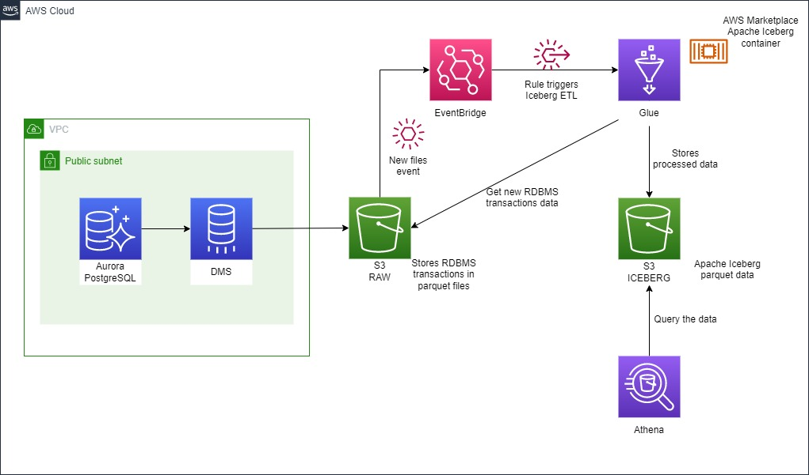

# Demo of RDBMS Ingestion Into Datalake with AWS Glue & Apache Iceberg 

## Credits
This demo is an extension of this AWS Blog article 
[Implement a CDC-based UPSERT in a data lake using Apache Iceberg and AWS Glue](https://aws.amazon.com/blogs/big-data/implement-a-cdc-based-upsert-in-a-data-lake-using-apache-iceberg-and-aws-glue/) 
by *Sakti Mishra*.

It extends that demo by:
- deploying an Amazon Aurora PostgreSQL database and aa AWS DMS (Database Migration Service) instance to ingest the 
RDBMS transaction data into S3.
- automating the trigger of the AWS Glue Job to convert the RDBMS transactions data into Apache Iceberg data files,
when the AWS DMS service writes files in the `RAW` S3 bucket.

The objective is to demo __end-to-end__ how the RDBMS transactions (INSERT, UPDATE, DELETE) are ingested into a datalake
by the AWS DMS, transformed using AWS Glue with the AWS Marketplace Apache Iceberg extension to provide "ACID 
transaction, UPSERT, time travel, schema evolution, auto compaction, and many more" and then queried through Amazon 
Athena.

## The Architecture


Note that in this demo the Amazon Aurora PostgreSQL database is deployed in a public VPC to allow direct access to the
database from a PostgreSQL client. __This is not recommended for production deployments__.

## Prerequisites
1. [Terraform](https://www.terraform.io/downloads) to deploy this demo infrastructure.
2. A PostgreSQL client like [pgAdmin](https://www.pgadmin.org/download/) to connect to the Aurora PostgreSQL database 
and perform queries on the DB.

## Deploying the demo
Please refer to this demo's [Terraform Documentation](./TERRAFORM.md) for more details about this Terraform code and
options.

1. Clone this repo and navigate into the repository folder.
2. Create in the folder an `env.tfvars` file and put the following content in it:
    ```
    aws_profile_name = "< The name of your AWS CLI profile>"
    db_password      = "<A password of your choice>"
    ```
3. From your CLI, initialize and deploy this demo infrastructure using Terraform
    ```bash
    terraform init
    terraform apply -var-file=env.tfvars
    ```
   
It will take several minutes (~12 min) for the Amazon Aurora RDS instance and AWS DMS instance to be deployed.

### Overview
In this demo you will perform the following steps:
1. Create a table in the Aurora PostgreSQL database and generate fake data. As a result you will see 
   1. AWS DMS ingesting the data into S3, where you will be able to see the database `INSERT` transaction data.
   2. AWS Glue converting the database transaction data into Apache Iceberg data files.
2. Using Athena, you will be able to see the table just like it is in the PostgreSQL database.
3. You will then update and insert rows in the Aurora PostgreSQL database and see DMS ingesting the data into S3 and
   Glue converting the new data into Apache Iceberg data files.
4. You will then be able to use Athena to do time travel and look at the data after the first initial ingestion.

## Finish Preparing the Environment
1. Navigate to the `RDS > Aurora PostgreSQL > iceberg-poc-source-db > iceberg-poc-source-db-1` instance and copy 
   the `Endpoint` and `Port` values
   
2. Configure your PostgreSQL client with the host, port, database name, username and password
3. Navigate to `AWS DMS > Endpoints` and for both endpoints open the `Connections tab` and make sure that the 
   connection to both endpoints is successful 
4. Still in the `AWS DMS` service, navigate to `Database migration tasks > iceberg-poc-cdc` instance, and in the 
   `Actions` menu, select `Restart/Resume`. Wait that the `Status`shows `Replication ongoing`.
5. Navigate to `Athena > Query Editor`, select the `iceberg-poc-wg` workgroup, and in the `Saved queries` tab,
   open the `create_iceberg_data_table` query and click `Run`. This will create the Glue Table for the
   Iceberg data in S3.

## The Demo
6. Using your PostgreSQL client run the SQL query in the `assets/rdbms/create-table.sql` file to create a `products` 
   table and insert random rows. This will create 1000 rows in the `products` table.
7. After few seconds, 
   1. in `AWS DMS > Database migration tasks > iceberg-poc-cdc > Table statistics` you should see a row for 1,000 inserts
   2. in the `Amazon S3 > Buckets > iceberg-poc-raw-data-bucket-*` you should see parquest data into the bucket
8. Navigate to `Amazon Athena > Query Editor`, select the `iceberg-poc-wg` workgroup, and select the `AwsDataCatalog`,
   the `iceberg_poc_db_*` database, the `iceberg_poc_raw_data_table_*` table and click on `Preview Table`. Note the time
   in the `ingested_at` column.
   
9. Navigate to `AWS Glue > AWS gLue Studio`, select the `iceberg-poc-glue-job-*` job. It should be triggered 
   automatically (you might have to wait ~1 minute) as objects are put on the RAW S3 bucket Wait for the job to complete
   (it will take several minutes).
10. Once the job is complete you should see data in the `Amazon S3 > Buckets > iceberg-poc-raw-data-bucket-*` S3 bucket
    in the `warehouse\data\` folder.
11. Go back to `Amazon Athena` and preview the data in the `iceberg_poc_iceberg_data_table_*` Glue table. You will see 
    the current data state instead of database transactions.
12. Go back to your PostgreSQL client and run the SQL commands in the `assets/rdbms/update-table.sql` file to both insert
    20 additional rows and increase the `price` and `quantities` if the first 10 products (id from 1 to 10). 
13. Navigate back to `AWS DMS > Database migration tasks > iceberg-poc-cdc > Table statistics` you should see the number
    of inserts has increased by 20 and the number of updates is now 10.
    
14. The `iceberg-poc-glue-job-*` Glue job should have been triggered automatically. Wait for the job to complete.
15. Once the job is complete go back to `Amazon Athena` and run the following queries
    1. `select * from iceberg_poc_iceberg_data_table_* where id > 990;` (replace the table name appropriately) to see 
       the products with an `ID > 990`. You should get 30 results with the last products from the first ingestion and 
       the 20 new products from the second ingestion.
    2. `select * from iceberg_poc_iceberg_data_table* where id < 11;` to see the first 10 products which have had their 
       `price` and `quantities` updated. The values should be the same if you run the query in the PostgreSQL table.
16. Open a new `Query `tab in Athena and perform the below queries to do time travel and look at the table after the 
    initial ingestion:
    1. `select * from iceberg_poc_iceberg_data_table_* for system_time as of timestamp '2022-10-21 17:00:00' where id > 990;` 
       (replace the table name and timestamp appropriately. The timestamp should be just after the initial ingestion time).
       You should now get only 10 results. (_Note: Be aware of timezone when selecting your time_).
    2. `select * from iceberg_poc_iceberg_data_table where id for system_time as of timestamp '2022-10-21 17:00:00' 
       where id < 11;` to see the first 10 products with their original `price` and lower `quantities` updated. Compare 
       them with the latest values from the previous query. They should be lower in this last queries as we increased 
       both quantities later.

__Tip:__ To select an appropriate time for the query, go in the `RAW` S3 bucket `iceberg-poc-raw-data-bucket-*` and 
check the time of the second file, remove 1 minute to it, convert it to UTC time and use it in the query.

You were able to travel in time!